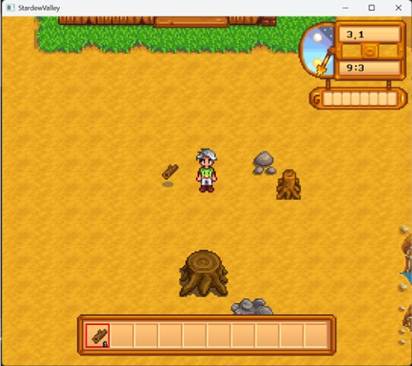
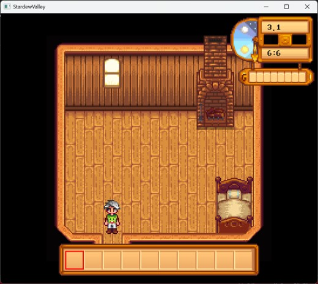
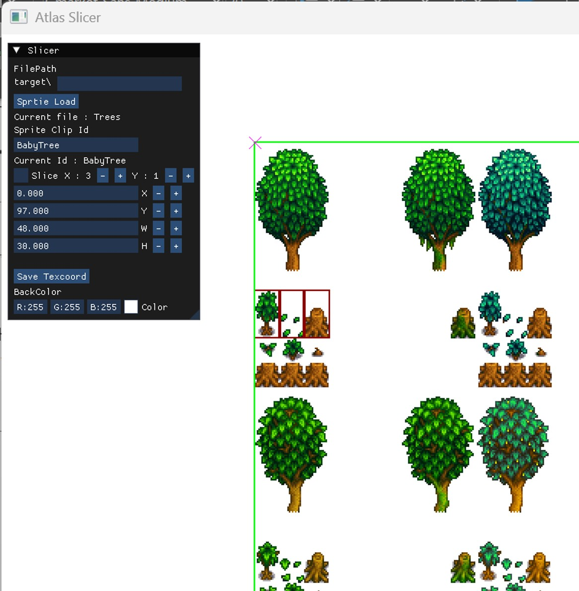
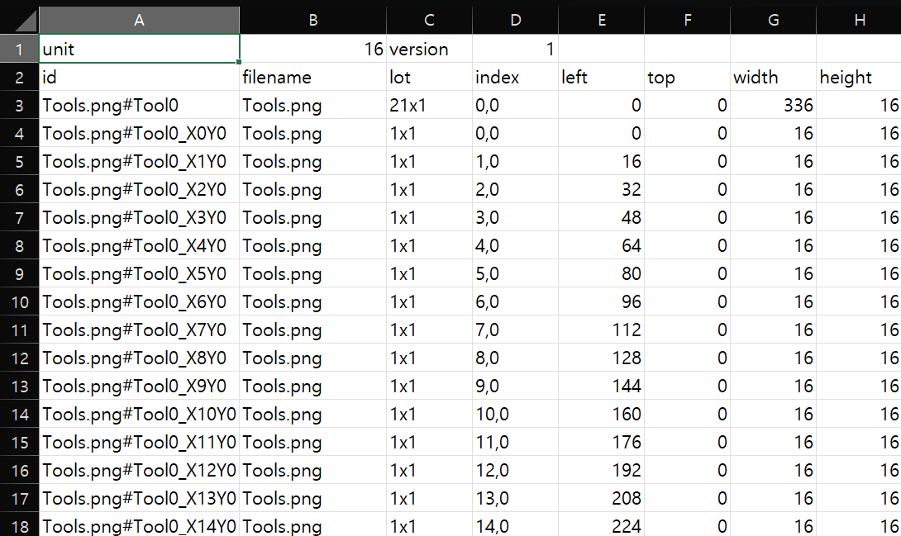

# 🌱 Stardew Valley 모작

🛠️ **개발 도구**
  

📅 **개발 기간**
24.11.26 ~ 24.12.09 (2주)

Stardew Valley를 모작한 프로젝트입니다.

---

## 🛠️ 주요 구현 요소
<table>
  <tr>
    <td align="center"><strong>계층 트랜스폼, 9-슬라이싱 스프라이트</strong></td>
    <td align="center"><strong>아틀라스 텍스처 추출 툴</strong></td>
  </tr>
  <tr>
    <td> </td>
    <td> </td>
  </tr>
</table>

- **SFML 프레임워크 제작**
  - 게임 루프, 씬 시스템, 이벤트 처리 등의 구조를 직접 구현
  - 부모-자식 관계에 따라 계층적으로 적용되는 계층 트랜스폼 구현 👉 [Transform.h](https://github.com/KALI-UM/SFML-StardewValley/blob/master/SFML-StardewValley/Framework/Transform.h)
  - 9슬라이싱스프라이트 구현 👉 [sf9SliceSprite.cpp](https://github.com/KALI-UM/SFML-StardewValley/blob/master/SFML-StardewValley/Framework/Drawable/sf9SliceSprite.cpp)

- **아틀라스 텍스처 좌표 지정 툴 제작**
  - ImGui 인스펙터로 조작
  - 텍스처에서 사용할 부분을 csv로 변환

